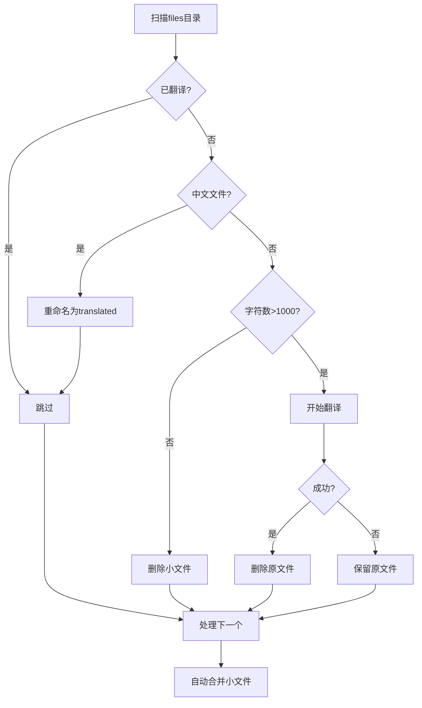

# 文档翻译工具

一个功能强大的多线程文档翻译工具，支持 PDF、EPUB、TXT 格式的批量翻译，支持多个 LLM 服务商，具备智能文本切割、自动重试、进度跟踪等功能。

## 功能特性

### 核心功能

- ✅ **多格式支持**：支持 PDF、EPUB、TXT 三种文档格式
- ✅ **多线程并行翻译**：大幅提升翻译速度，可自定义线程数
- ✅ **智能文本切割**：根据句子边界智能切割文本，保持语义完整性
- ✅ **自动重试机制**：网络不稳定时自动重试，提高成功率
- ✅ **多服务商支持**：支持 AkashML、DeepSeek 和 Hyperbolic 三个 LLM 服务商（通过命令行参数选择）
- ✅ **批量处理**：自动扫描目录并批量翻译文件
- ✅ **文件合并**：自动合并小型翻译文件，便于管理
- ✅ **进度跟踪**：实时显示翻译进度和统计信息
- ✅ **智能文件检测**：自动检测中文文件并重命名，跳过已翻译文件

### 高级特性

- 智能空白页过滤（EPUB）
- 自然排序文件处理
- 翻译失败标记和保留原文
- 字符数统计和筛选
- 可选的备份和删除功能
- 自动跳过已存在翻译结果的文件
- 自动删除字符数不足的文件（< 1000 字符）

## 安装说明

### 环境要求

- Python >= 3.12

### 安装依赖

项目使用 `uv` 进行依赖管理：

```bash
# 如果还没有安装 uv
curl -LsSf https://astral.sh/uv/install.sh | sh

# 安装项目依赖
uv sync
```

或者使用传统的 pip 安装：

```bash
pip install beautifulsoup4 ebooklib openai pypdf2 requests retry
```

### 环境变量配置

在使用前，需要设置相应服务商的 API Key：

```bash
# AkashML 服务
export AKASHML_API_KEY="your_akashml_api_key"

# DeepSeek 服务
export DEEPSEEK_API_KEY="your_deepseek_api_key"

# Hyperbolic 服务
export HYPERBOLIC_API_KEY="your_hyperbolic_api_key"
```

## 使用方法

### ✅ 准备工作

开始使用前，请确认以下条件已满足：

- [ ] **Python 环境**：已安装 Python >= 3.12
- [ ] **项目依赖**：已执行 `uv sync` 或 `pip install` 安装依赖
- [ ] **API 密钥**：已配置对应服务商的 API Key 环境变量
- [ ] **待翻译文件**：已准备好文件（支持 `.txt`、`.pdf`、`.epub` 格式）

### 🚀 三步快速上手

#### 第一步：安装依赖

```bash
# 推荐使用 uv（更快）
curl -LsSf https://astral.sh/uv/install.sh | sh
uv sync

# 或使用传统 pip
pip install beautifulsoup4 ebooklib openai pypdf2 requests retry
```

#### 第二步：配置 API Key

选择一个服务商并配置其 API Key（必需）：

```bash
# 选项 1：AkashML（推荐，性价比高）
export AKASHML_API_KEY="your_akashml_api_key"

# 选项 2：DeepSeek
export DEEPSEEK_API_KEY="your_deepseek_api_key"

# 选项 3：Hyperbolic
export HYPERBOLIC_API_KEY="your_hyperbolic_api_key"
```

#### 第三步：开始翻译

```bash
# 安装命令行工具（推荐，使用更简洁）
uv pip install -e .

# 翻译单个文件（最简单的方式）
translate job your_file.pdf

# 批量翻译 files/ 目录下的所有文件
translate batch

# 就这么简单！翻译结果保存为 "原文件名 translated.txt"
```

**不想安装？直接使用模块：**

```bash
python -m translation_app.cli.main job your_file.pdf
python -m translation_app.cli.main batch
```

### 📊 工作流程可视化

#### 单文件翻译流程


#### 批量翻译自动化流程



### ❓ 遇到问题？快速排查

| 问题 | 可能原因 | 解决方案 |
|------|---------|---------|
| ❌ `API key not found` | 未配置环境变量 | 执行 `export AKASHML_API_KEY="your_key"` |
| ❌ `translate: command not found` | 未安装命令行工具 | 执行 `uv pip install -e .` |
| ❌ `Unsupported file format` | 文件格式不支持 | 确认文件是 `.txt`、`.pdf` 或 `.epub` 格式 |
| ❌ `Permission denied` | 文件权限问题 | 检查文件读写权限：`chmod 644 your_file.txt` |
| ⚠️ 翻译速度慢 | 线程数设置过低 | 代码中调整 `max_workers` 参数（建议 3-10） |

### 1. 单文件翻译

通过命令行参数指定要翻译的文件：

```bash
# 基本用法（使用默认服务商 AkashML）
python -m translation_app.cli.main job myfile.txt

# 或者安装后使用
translate job myfile.txt

# 指定文件路径
translate job files/document.pdf

# 指定服务商
translate job myfile.txt --provider deepseek
translate job book.epub -p hyperbolic

# 查看帮助信息
translate job --help
```

**参数说明**：
- `文件路径`：要翻译的文件（支持 .txt、.pdf、.epub），必需参数
- `--provider` 或 `-p`：选择服务商（akashml、deepseek、hyperbolic），可选，默认为 akashml
- 文件路径支持相对路径和绝对路径
- 翻译结果自动保存为 `原文件名 translated.txt` 格式

**作为 Python 模块使用**：

```python
from translation_app.domain.translator import Translator
from translation_app.core.translate_config import create_translate_config
from translation_app.core.providers import get_provider
from translation_app.infra.openai_client import build_openai_client

# 方式 1: 使用便捷函数创建配置
provider_config = get_provider('akashml')  # 或 'deepseek', 'hyperbolic'

config = create_translate_config(
    max_workers=5,
    max_retries=3,
    retry_delay=1,
    chunk_size=8000,
    min_chunk_size=500,
    api_timeout=60,
    api_base_url=provider_config.api_base_url,
    model=provider_config.model,
    api_key=provider_config.api_key,
    client_factory=build_openai_client
)

translator = Translator("your_file.pdf", config)
translator.run()

# 方式 2: 使用服务层
from translation_app.services.job_service import run_single_file

success = run_single_file("your_file.pdf", provider='akashml')
```

### 2. 批量翻译

批量翻译 `files/` 目录下的所有文件：

```bash
# 使用默认服务商（AkashML）
python -m translation_app.cli.main batch

# 或者安装后使用
translate batch

# 指定服务商
translate batch --provider akashml
translate batch --provider deepseek
translate batch --provider hyperbolic
```

**批量翻译的自动化流程**：

1. 扫描 `files/` 目录下的所有 `.txt`、`.pdf`、`.epub` 文件
2. 自动跳过已翻译的文件（文件名以 `translated.txt` 结尾）
3. 检测中文文件（中文字符占比 >= 30%），自动重命名为 `原文件名 translated.txt` 格式
4. 删除字符数 < 1000 的文件
5. 跳过已存在翻译结果的文件（如果已存在 `原文件名 translated.txt`，则删除原文件）
6. 依次翻译剩余文件
7. 翻译成功后删除原文件
8. 自动调用合并脚本合并小型文件（< 10万字）

### 3. 文件合并

合并小型翻译文件：

```bash
# 基本用法
python -m translation_app.cli.main merge

# 或者安装后使用
translate merge

# 自定义选项
translate merge --files-dir files --keep-originals --backup
```

**合并规则**：

- 筛选出中文字数 < 10万字的 `*translated.txt` 文件
- 按文件名自然排序
- 合并成不超过 20万字的文件
- 保存到 `files/combined/` 目录
- 可选：删除原文件并备份

**作为 Python 模块使用**：

```python
from translation_app.services.merge_service import merge_entrance

merge_entrance(
    files_dir="files",          # 输入文件目录
    delete_originals=True,      # 是否删除原文件（默认True）
    backup=False                # 是否备份原文件（默认False）
)
```

### 4. 本地 Ollama 测试

使用本地 Ollama 模型进行翻译（零成本）：

```bash
# 确保本地运行了 Ollama 服务
# 默认地址：http://localhost:11434

python examples/ollama_local_qwen2.py
```

**注意**：需要在脚本中修改 `MODEL_NAME` 和 `source_origin_book_name` 变量。

## 配置说明

### TranslateConfig 参数

| 参数 | 类型 | 默认值 | 说明 |
|------|------|--------|------|
| 参数 | 类型 | 默认值 | 说明 |
|------|------|--------|------|
| `max_workers` | int | 5 | 最大线程数，建议 3-10 个 |
| `max_retries` | int | 3 | 最大重试次数 |
| `retry_delay` | int | 1 | 重试延迟时间（秒） |
| `chunk_size` | int | 8000 | 文本切割阈值（字符数） |
| `min_chunk_size` | int | 500 | 最小切割长度（字符数） |
| `api_timeout` | int | 60 | API 超时时间（秒） |
| `api_base_url` | str | 必需 | API 基础 URL |
| `model` | str | 必需 | 模型名称 |
| `api_key` | str | 必需 | API 密钥 |

**注意**：单文件翻译（job）和批量翻译（batch）的默认配置可能不同，请根据实际使用情况调整。配置定义在 `core/config.py` 的 `TranslationDefaults` 类中。

### 服务商配置

#### AkashML

```python
LLM_API_BASE_URL = 'https://api.akashml.com/v1'
LLM_MODEL = 'Qwen/Qwen3-30B-A3B'
LLM_API_KEY = os.environ.get('AKASHML_API_KEY')
```

#### DeepSeek

```python
LLM_API_BASE_URL = 'https://api.deepseek.com'
LLM_MODEL = 'deepseek-chat'
LLM_API_KEY = os.environ.get('DEEPSEEK_API_KEY')
```

#### Hyperbolic

```python
LLM_API_BASE_URL = 'https://api.hyperbolic.xyz/v1'
LLM_MODEL = 'openai/gpt-oss-20b'
LLM_API_KEY = os.environ.get('HYPERBOLIC_API_KEY')
```

### 环境变量

| 变量名 | 说明 | 必需 |
|--------|------|------|
| `AKASHML_API_KEY` | AkashML API 密钥 | 使用 AkashML 时必需 |
| `DEEPSEEK_API_KEY` | DeepSeek API 密钥 | 使用 DeepSeek 时必需 |
| `HYPERBOLIC_API_KEY` | Hyperbolic API 密钥 | 使用 Hyperbolic 时必需 |
| `TRANSLATION_WORK_DIR` | 工作目录路径 | 可选，默认 `files` |
| `LOG_LEVEL` | 日志级别（DEBUG/INFO/WARNING/ERROR） | 可选，默认 INFO |
| `LOG_SHOW_CONTENT` | 是否在日志中显示翻译内容预览（true/false） | 可选，默认 true |

**自定义工作目录示例**：

```bash
# 使用自定义工作目录
export TRANSLATION_WORK_DIR="/path/to/custom/files"
translate batch
```

## 项目结构

```
translation/
├── pyproject.toml              # 项目依赖配置
├── README.md                   # 项目文档
├── translation_app/            # 核心应用包
│   ├── __init__.py
│   ├── cli/                    # 命令行接口
│   │   ├── __init__.py
│   │   ├── main.py             # 统一 CLI 入口
│   │   └── logging_setup.py    # 日志配置
│   ├── core/                   # 核心配置层
│   │   ├── __init__.py
│   │   ├── config.py           # 配置管理（支持环境变量）
│   │   ├── providers.py        # 服务商配置
│   │   ├── translate_config.py # 翻译配置
│   │   ├── file_analyzer.py    # 文件分析（复用 extractors）
│   │   ├── file_ops.py         # 文件操作
│   │   └── path_utils.py       # 路径工具
│   ├── domain/                 # 领域层（核心业务逻辑）
│   │   ├── __init__.py
│   │   ├── extractors/         # 文本提取器
│   │   │   ├── __init__.py
│   │   │   ├── base_extractor.py
│   │   │   ├── pdf_extractor.py
│   │   │   ├── epub_extractor.py
│   │   │   └── txt_extractor.py
│   │   ├── file_merger.py      # 文件合并算法
│   │   ├── text_processor.py   # 文本处理器
│   │   └── translator.py       # 翻译核心逻辑
│   ├── services/               # 服务层（流程编排）
│   │   ├── __init__.py
│   │   ├── batch_service.py    # 批量翻译服务
│   │   ├── job_service.py      # 单文件翻译服务
│   │   ├── merge_service.py    # 文件合并服务
│   │   └── file_preprocessor.py # 文件预处理服务
│   └── infra/                  # 基础设施层
│       ├── __init__.py
│       └── openai_client.py    # OpenAI 客户端封装
├── examples/                   # 示例脚本
│   ├── akash_llm.py            # AkashML API 测试
│   ├── hyperbolic.py           # Hyperbolic API 测试
│   └── ollama_local_qwen2.py   # 本地 Ollama 翻译测试
└── files/                      # 工作目录（可通过环境变量覆盖）
    ├── combined/               # 合并后的文件目录
    └── .backup/                # 备份目录
```

### 架构说明

项目采用清晰的分层架构，职责明确：

```
┌─────────────────────────────────────────────────────────┐
│                      CLI 层                              │
│                    (main.py)                             │
└─────────────────────────┬───────────────────────────────┘
                          ▼
┌─────────────────────────────────────────────────────────┐
│                    服务层 (services/)                    │
│  batch_service │ job_service │ merge_service            │
│                │ file_preprocessor                      │
└─────────────────────────┬───────────────────────────────┘
                          ▼
┌─────────────────────────────────────────────────────────┐
│                   领域层 (domain/)                       │
│  Translator │ TextProcessor │ FileMerger │ Extractors   │
└─────────────────────────┬───────────────────────────────┘
                          ▼
┌──────────────────────────────────┬──────────────────────┐
│         配置层 (core/)           │   基础设施 (infra/)   │
│  config │ providers │ analyzers  │   openai_client      │
└──────────────────────────────────┴──────────────────────┘
```

#### 配置层 (core/)
- **config.py**: 统一管理所有配置项，支持环境变量覆盖
- **providers.py**: 管理 LLM 服务商配置（AkashML、DeepSeek、Hyperbolic）
- **translate_config.py**: 翻译配置类（组合模式）
- **file_analyzer.py**: 文件分析（复用 extractors 进行内容提取）
- **file_ops.py**: 安全的文件操作（删除、重命名）
- **path_utils.py**: 路径处理工具

#### 领域层 (domain/)
- **extractors/**: 文本提取器，支持 PDF、EPUB、TXT 格式
  - 使用策略模式，通过 `get_extractor()` 工厂函数获取对应提取器
  - 基于 `BaseExtractor` 抽象基类，支持扩展新格式
- **text_processor.py**: 智能文本切割，保持句子完整性
- **file_merger.py**: 文件合并核心算法（分组、排序、筛选）
- **translator.py**: 核心翻译逻辑
  - 多线程并行翻译
  - 自动重试机制
  - 进度跟踪和统计
  - 支持依赖注入（client_factory）

#### 服务层 (services/)
- **batch_service.py**: 批量翻译流程编排
- **job_service.py**: 单文件翻译流程编排
- **merge_service.py**: 文件合并流程编排（调用 FileMerger）
- **file_preprocessor.py**: 文件预处理（筛选、检测、清理）

#### 基础设施层 (infra/)
- **openai_client.py**: OpenAI 客户端创建和管理

#### 命令行接口 (cli/)
- **main.py**: 统一 CLI 入口，支持子命令（job、batch、merge）
- **logging_setup.py**: 日志配置初始化

#### 依赖关系
```
cli → services → domain
         ↓         ↓
       core    ← core ← infra
```

- **cli** 依赖 **services**
- **services** 依赖 **domain** 和 **core**
- **domain** 依赖 **core**（配置）
- **core/file_analyzer** 依赖 **domain/extractors**（复用提取逻辑）
- **infra** 独立，被 **services** 使用
- **core** 被所有层使用，不依赖其他层（除 file_analyzer）

## 工作流程

### 单文件翻译流程

1. 读取源文件（PDF/EPUB/TXT）
2. 提取文本内容
3. 智能切割文本（保持句子完整性）
4. 多线程并行翻译各个文本块
5. 自动重试失败的翻译
6. 合并翻译结果
7. 保存为 TXT 文件

### 批量翻译流程

1. 扫描 `files/` 目录下的所有 `.txt`、`.pdf`、`.epub` 文件
2. 预处理筛选：
   - 跳过已翻译文件（文件名以 `translated.txt` 结尾）
   - 检测中文文件并重命名（中文字符占比 >= 30%）
   - 删除字符数 < 1000 的文件
   - 跳过已存在翻译结果的文件（删除原文件）
3. 依次翻译每个文件
4. 翻译成功后删除原文件
5. 自动调用合并脚本合并小型文件（< 10万字）

### 文件合并流程

1. 扫描所有 `*translated.txt` 文件
2. 统计每个文件的中文字符数
3. 筛选出 < 10万字的文件
4. 按文件名自然排序
5. 合并成不超过 20万字的文件
6. 保存到 `files/combined/` 目录
7. 可选：备份并删除原文件

## 注意事项

### 性能优化

- **线程数设置**：根据 API 服务商的并发限制调整，建议不超过 10 个线程
  - 批量翻译（batch）默认使用 8 个线程
  - 单文件翻译（job）默认使用 1 个线程
- **文本切割**：`chunk_size` 应根据模型的最大上下文长度调整
  - AkashML Qwen/Qwen3-30B-A3B：上下文限制 32K，批量翻译默认 `chunk_size=3000`
  - 单文件翻译默认 `chunk_size=50000`，`min_chunk_size=30000`（适合大文件）
- **重试策略**：网络不稳定时建议增加重试次数和延迟时间
  - 默认 `max_retries=6`，`retry_delay=120` 秒

### 错误处理

- 翻译失败的文本块会被标记为 `[翻译失败 - Chunk N]` 并保留原文
- 如果所有 chunk 翻译失败，不会保存文件
- 批量翻译时会记录失败的文件，不会中断整个流程

### 文件管理

- 翻译后的文件命名格式：`原文件名 translated.txt`
- 批量翻译会自动删除原文件（翻译成功后）
- 批量翻译会自动检测中文文件（中文字符占比 >= 30%），并重命名为 `原文件名 translated.txt` 格式
- 批量翻译会自动删除字符数 < 1000 的文件
- 批量翻译会自动跳过已存在翻译结果的文件（删除原文件）
- 合并脚本支持备份功能，删除前会先备份到 `files/.backup/` 目录（带时间戳）

### 格式支持

- **PDF**：使用 PyPDF2 提取文本，可能无法完美处理扫描版 PDF
- **EPUB**：自动过滤空白页和样式文件，只提取正文内容，支持多种 MIME 类型
- **TXT**：支持 UTF-8、GBK、GB2312 编码

**输出格式**：当前版本只生成 TXT 文件（`原文件名 translated.txt`），不生成 PDF 文件。

## 日志说明

项目使用 Python 标准 logging 模块，日志格式：

```
2025-01-01 12:00:00 [INFO] Translator: [任务] 开始翻译
```

日志级别可通过 `LOG_LEVEL` 环境变量控制：

```bash
export LOG_LEVEL=DEBUG  # 显示详细调试信息
export LOG_LEVEL=INFO   # 显示一般信息（默认）
export LOG_LEVEL=WARNING  # 只显示警告和错误
```

控制是否在日志中显示翻译内容预览（隐私保护）：

```bash
export LOG_SHOW_CONTENT=false  # 不显示翻译内容预览（默认 true）
```

## 示例

### 示例 1：翻译单个 PDF 文件

```python
from translation_app.domain.translator import Translator
from translation_app.core.translate_config import create_translate_config
from translation_app.core.providers import get_provider
from translation_app.infra.openai_client import build_openai_client

# 获取服务商配置
provider_config = get_provider('akashml')

# 创建翻译配置
config = create_translate_config(
    max_workers=5,
    max_retries=3,
    retry_delay=2,
    chunk_size=8000,
    min_chunk_size=500,
    api_timeout=60,
    api_base_url=provider_config.api_base_url,
    model=provider_config.model,
    api_key=provider_config.api_key,
    client_factory=build_openai_client
)

translator = Translator("document.pdf", config)
translator.run()
```

### 示例 2：批量翻译并自动合并

```bash
# 将所有待翻译文件放入 files/ 目录
translate batch --provider akashml

# 脚本会自动：
# 1. 翻译所有文件
# 2. 删除原文件
# 3. 合并小型翻译文件
```

## 常见问题

**Q: 翻译速度慢怎么办？**  
A: 可以适当增加 `max_workers` 线程数，但要注意 API 服务商的并发限制。

**Q: 某些文本块翻译失败？**  
A: 失败的内容会被标记并保留原文，可以检查日志查看失败原因，通常是网络问题或文本过长。

**Q: 如何调整文本切割大小？**  
A: 根据使用的模型上下文限制调整 `chunk_size` 和 `min_chunk_size` 参数。默认配置定义在 `core/config.py` 的 `TranslationDefaults` 类中，单文件翻译和批量翻译使用不同的默认值。

**Q: 翻译后的文件在哪里？**  
A: 翻译结果保存在 `files/` 目录下，文件名格式为 `原文件名 translated.txt`。合并后的文件在 `files/combined/` 目录。

**Q: 批量翻译时为什么有些文件被跳过了？**  
A: 批量翻译会自动跳过以下文件：
- 文件名以 `translated.txt` 结尾的文件（已翻译）
- 中文字符占比 >= 30% 的 `.txt` 文件（会被重命名为 `translated.txt` 格式）
- 字符数 < 1000 的文件（会被删除）
- 已存在翻译结果的文件（原文件会被删除）

**Q: 如何选择不同的 LLM 服务商？**  
A: 使用 `--provider` 或 `-p` 参数：
```bash
translate job myfile.txt --provider akashml    # 或 deepseek、hyperbolic
translate batch --provider deepseek
```

## 许可证

本项目未指定许可证，请根据实际使用情况自行判断。

## 贡献

欢迎提交 Issue 和 Pull Request！
